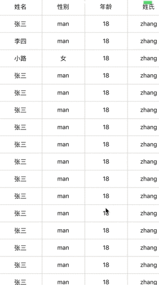

# react-native-table
#### 一个简单的表格组件，可以固定头部和左侧
#### 预览

#### 使用
```js
import React, { Component } from 'react';
import Table from './Table';

const head = [
  '姓名',
  '性别',
  '年龄',
  '姓氏',
  '名字',
  '内容',
];

const list = [
  {
    name: '张三', sex: 'man', age: 18, firstName: 'zhang', seconName: 'san', content: 'hahahahh',
  },
  {
    name: '李四', sex: 'man', age: 18, firstName: 'zhang', seconName: 'san', content: 'hahahahh',
  },
  {
    name: '小路', sex: '女', age: 18, firstName: 'zhang', seconName: 'san', content: 'hahahahh',
  },
];

export default class GirdFlat extends Component {
  render() {
    return (
      <Table
        head={head}
        list={list}
      />
    );
  }
}

````
